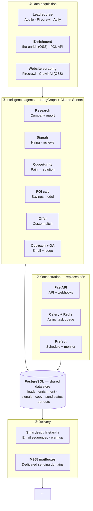

# Architecture

End-to-end pipeline for the B2B sales agent — from raw lead acquisition through
AI-driven research and copywriting to email delivery. Data flows top to bottom,
with **PostgreSQL** as the shared store every stage reads from and writes to.

---

## ① Data acquisition

Pull prospects, enrich them into full firmographic/contact records, and scrape
each account's website for raw material the agents reason over.

| Component | Tools | Purpose |
| --- | --- | --- |
| **Lead source** | Apollo · Firecrawl · Apify | Discover prospects and accounts to target |
| **Enrichment** | fire-enrich (OSS) · PDL API | Fill in verified contact + firmographic data |
| **Website scraping** | Firecrawl · Crawl4AI (OSS) | Extract site content for downstream research |

## ② Intelligence agents

A **LangGraph** graph driving **Claude Sonnet**. Each node turns raw lead data
into a piece of the outreach: research → signals → opportunity → ROI → offer →
outreach, with a QA judge gating the final email.

| Agent | Output | Purpose |
| --- | --- | --- |
| **Research** | Company report | Synthesize a profile of the account |
| **Signals** | Hiring · reviews | Detect buying/timing signals |
| **Opportunity** | Pain → solution | Map a pain point to our solution |
| **ROI calc** | Savings model | Quantify the value / expected savings |
| **Offer** | Custom pitch | Build a tailored offer for the lead |
| **Outreach + QA** | Email + judge | Draft the email and judge it before send |

## ③ Orchestration

Replaces **n8n** with code-first orchestration — the API surface, the async work
queue, and the scheduler/monitor that keep the pipeline running.

| Component | Role | Purpose |
| --- | --- | --- |
| **FastAPI** | API + webhooks | Entry points and inbound event handling |
| **Celery + Redis** | Async task queue | Run long-running jobs off the request path |
| **Prefect** | Schedule + monitor | Schedule runs and observe pipeline health |

## PostgreSQL — shared data store

The single source of truth wired to every stage. Persists:

`leads` · `enrichment` · `signals` · `copy` · `send status` · `opt-outs`

## ④ Delivery

Send the approved copy through warmed-up inboxes on dedicated sending
infrastructure.

| Component | Role | Purpose |
| --- | --- | --- |
| **Smartlead / Instantly** | Email sequences · warmup | Run sequences and keep inboxes warm |
| **M365 mailboxes** | Dedicated sending domains | Isolated sending identities for deliverability |

---

> **(OSS)** marks open-source components. The pipeline continues past delivery
> (reply handling, analytics, feedback into the data store).
